# Pytagora

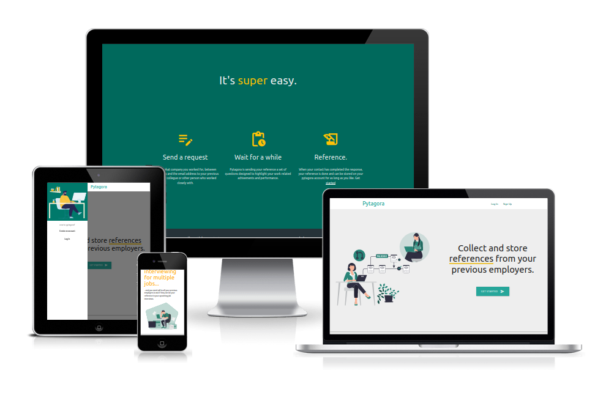


Pytagora is a software service that can help jobseekers get the a reference from their
previous employers and let them save references to be used in multiple future job interviews.


| Problem | Solution |
|---------|----------|
| Multiple recruiters contacting the same reference for a reference check | Pytagora allows the candidate to initiate the reference check and send the request to the reference |
| No way for the candidate to save the answers from a reference for future recruitment processes | Pytagora allows the candidate to store completed reference checks for future use |
| Recruiter and reference may not have time to talk at the same time, leading to rescheduling and lost productivity for the recruiter | Pytagora allows the reference to answer the questions on their own time, avoiding the need for scheduling |
| Candidate is not the owner of their own reference information | Pytagora allows the candidate to be the owner of their own reference information, stored digitally |
| Reference checks can be time-consuming for recruiters | Pytagora streamlines the reference check process, allowing recruiters to spend more time on other tasks |
| Recruiters may not have access to all relevant reference information | Pytagora allows the candidate to provide access to multiple references, ensuring that all relevant information is available |
| Candidates may not have access to past colleagues or managers to use as references | Pytagora allows the candidate to use any professional contact as a reference, regardless of their current employment status |


## Technical approach

### app overview
Pytagora consists of 2 apps. 
the "core" app and the "userprofile" app. 

In the core app, the standard user model is overridden. 
in the userprofile app the data related to a user's profile, sending a 'reference request' and receiving a 'reference response' lives.

``` python
ms-four/
├── manage.py
├── staticfiles
├── pytagora/
│   ├── __init__.py
│   ├── asgi.py
│   ├── settings.py
│   ├── urls.py
│   └── wsgi.py
├── core/
│   ├── __init__.py
│   ├── admin.py
│   ├── apps.py
│   ├── migrations/
│   │   ├── __init__.py
│   ├── models.py # AbstractBaseUserModel *1.
│   ├── managers.py # custom user managers *2.
│   ├── middleware.py # custom middleware *3.
│   ├── tokens.py # custom token *4.
│   ├── tests.py
│   └── views.py
└── userprofile/
    ├── __init__.py
    ├── admin.py
    ├── apps.py
    ├── migrations/
    │   ├── __init__.py
    ├── models.py # Profile, RefRquest and RefRespnse 
    ├── tests.py
    └── views.py
```

The core app contains a few more unusual files. Here they are explained.
> *1. The AbstractBaseUser Model is created in the core apps 'models.py' file

>  *2. 'managers.py' contains the user creation managers that is used to create a user or superuser from the terminal (e.g. python3 manage.py createsuperuser)

> *3. The custom middleware script in 'middleware.py' made sure I could use my app with in an iframes with https://ui.dev/amiresponsive, only to create the image at the top of this readme.

> *4. custom Token is a file that contains a self made method of creating and encrypting a link that is used to update a reference response (RefResponse model) read more at TOKEN LINK CREATION under "how pytagora works" below.

#### **why AbstractBaseUser model and the core app?**
Users of this application will be using their real name when requesting a references, so a username is not nesseasary. I therefore wanted to use the email-adress as the "username field" and the easiest way of doing that was to create an entire new user model by extending djangos "AbstractBaseUser" class. Since I am new to django and since the user model needs to be correct on the first migration, I didn't really want to mess to much with the user model and decided to put it in a separate app and don't touch it when I got it to work the way I wanted it to.
   
### Database Structure

In the userprofile app in the main database models for this project is defined. 
As you can see below, the profile contains a users first- and last name, and this model is meant to be extended with more information than just the name, as the more features are added to Pytagora.

A user can only have one profile and therefore has a **one-to-one** relation to the AbstractBaseUser.

on a the userprofile the user can send multiple reference requests, so there is a **one-to-many** relation from the profile to the reference request.

A reference request can only recieve a single response, since it is sent to a single person, so there is a **one-to-one** relation between the RefRequest and RefResponse.

To make it easier to query responses from a profile, a **many-to-one** relation between the RefResponse and Profile has also been added.
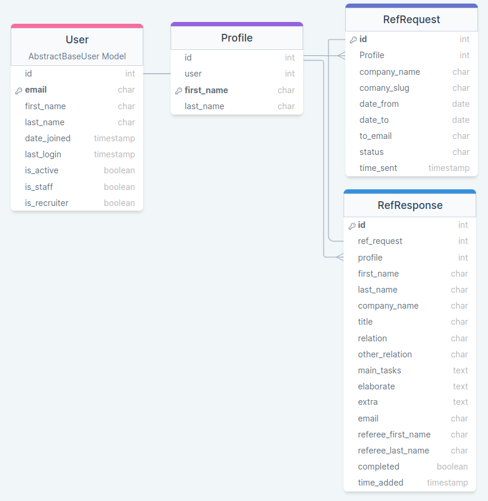


### How Pytagora works
>**1. CRUD - CREATE**
>
> 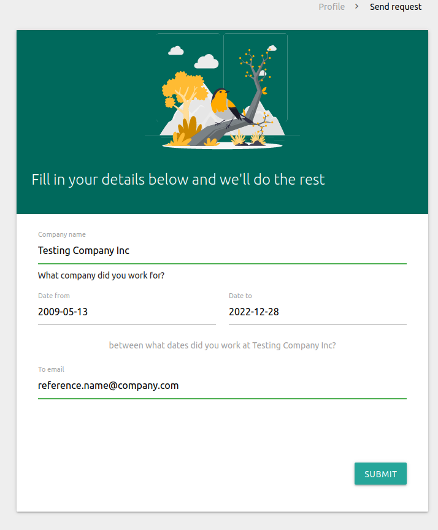
>
>   **A user creates a Reference request by filling out a form asking for the following**
> - the name of the company the user worked for
> - the date when user started working at the company
> - the end date when the user stopped working at the company
> - and an email-adress to the reference the request should be sent to
>
> When a reference request is created a couple of things happens in the background, both from the "create view" and with the use of "django signals"
> 
> - the status if the request is changed from UNIN (uninitiated) to PEND (pending)
> - a reference response is created, it is almost empty at this stage, but it contains the company name, that the user filed in in the RefRequest. This is done using django signals on save. It also contains the referee_first_name and "referee_last_name" which is the users name.

> **2. TOKEN LINK CREATION**
>
> 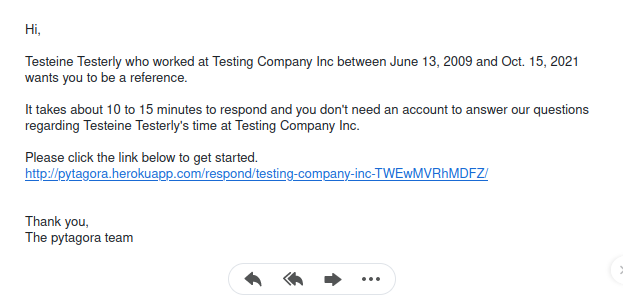
>
> To make Pytagora more easy to use for references, I don't want to force them to sign up in order to respond.
> So we have a situation where user asking for a reference is a signed in pytagora user with an active user session, but the reference completing the response is an anonymous user. 
>
> In order to make this app safe, to avoid endpoint attacks and still have non session users answer specific reference request, I decided to create a token link similar to a password reset link, or account activation link that is common on many websites.
> 
> The link is created by merging a slugified version of the company name and a an encrypted version of the id of the reference request. To further extend the safety, a secret 3 character diluder is mixed in between the letters of the encrypted reference request id and then it is encrypted again. 
>
> The end result is a link that looks something like this:
> > https://domain.name/company-name-HZSfDXFsdfF/ 
>
> The token link correlates to a dynamic url which correlates to an UpdateView. In the view, the link is then decrypted and the reference request id extracted. Once the request ID is extracted, the correlating reference response can be queried and rendered to the anonymous user.
>
> **Note that this** is a solution that I have come up with myself, there might be more safe ways to go about this, I am a beginner. 
> 
> But I have some confidence in this solution since a hacker needs to be able to both guess the company name, the right request id and know how the encryption is working in order to reach the correct view. The link is also invalid after the request is set to "complete" since that will redirect the anonomous user away from the dynamic url.

>**3. CRUD - UPDATE**
>
> 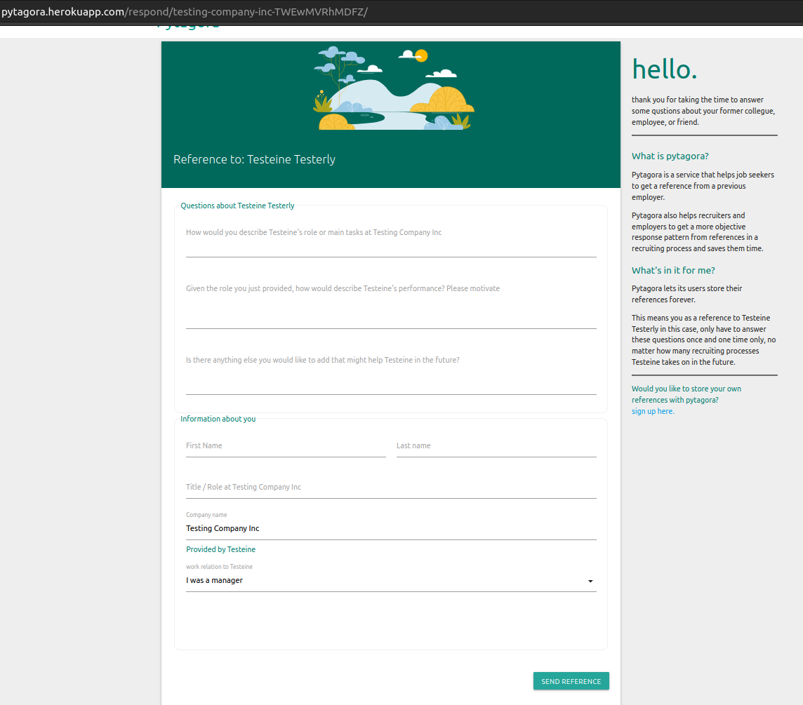
>
> The Reference Response is created in step one through a django signal from the reference request.
> Here in step 3 the anonomous user (the requested reference) can complete the reference response through an update view on the reference response. (Pleas read step 2 if you think this sounds unsafe)
>
> In order to make the life easier for the reference, I wanted some fields to be prepopulated for them, but I also wanted the reference to be able to change the information if they think it is wrong. 
>
> For example: the company name is prepopulated in the reference response that is created when a reference request is created. By using an update view, This information is then shown to the reference, but can be changed before submitting if the reference responder does not want to stand by the information provided by the reference requester. 
>
> When the reference submits the updated reference response, a boolean field on the RefResponse model named "completed" is set to "True". This redirects any user that tries to access the dynamic URL that was created with the token-link.
>

>**3. CRUD - READ**
>
> 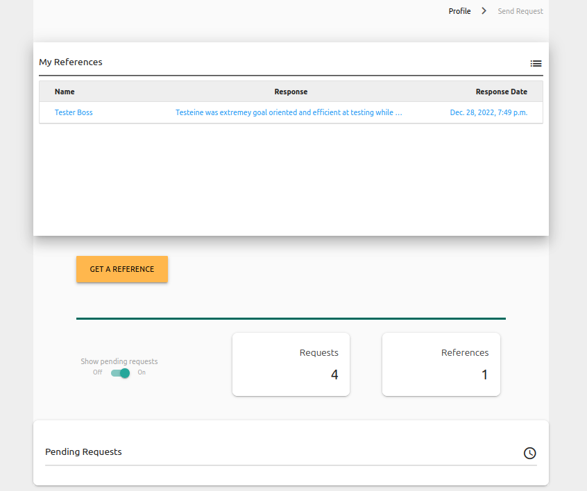
>
> when a RefResponse is completed, it changes the correlating RefRequest's status, from PEND (pending) to COMP (complete). Only pending requests are visually represented in a users profile, so this action hides the request and shows reference on the user's profile. 
> 
> When a reference is completed and shows up on the users profile, the user can access a detail view on the reference, and fully read the reference response. 
> 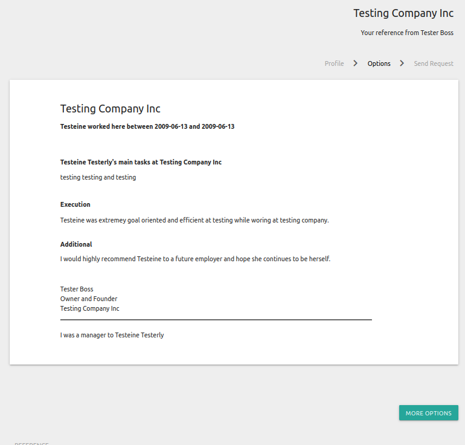
>

>**3. CRUD - DELETE**
>
> 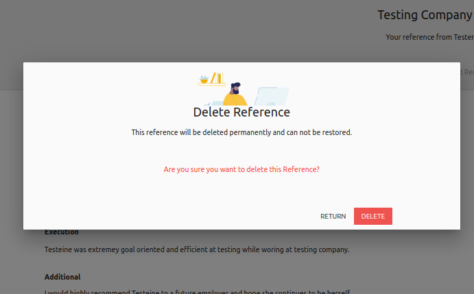
>
> On the detail view, The user has the option to delete the reference response and correlating reference request by clicking the delete button. 

> **CRUD - DELIBIRATE LIMITATIONS**
> 
> - there is no update view on the reference_request. only on the reference response, and that is filled in by another user. The reason a reference request can not be updated is because if the user updates the company name for example, the link and other information that is sent to the reference in the email would be missleadning and false.
> It is therefore better for a user to delete the reference request completetly and send a new reference requiest with the correct details.
> 
> - A reference request can only be deleted during the time it is pending. This is because when a user deletes a reference request it also deletes the reference response through CASCADE. A user should not be able to delete a **completed** reference response by deleting its reference request.
> 
> - The reference response is updated by the requested reference, it is not updated by the user herself. The point of this app is to get a reference from another person, if you could alter the result, there would be no point of having this app in the first place, they user could just write her own references.
>
> - A user can not change his email adress (which is the username) or name. Doing so could let the user more easily fake references requests from other people and save references from multiple people in one account.

> **CRUD - EXTRA CRUD FUNCTIONALITY**
> >
> There was a discussions in the CodeInstitute Slack community on how to interpret the requirements for CRUD functionality in this project. Someone thought that if a user can not update a model him or herself the project would fail because of how the requirements was formulated. 
>
> I argue that CRUD-functionality is refeering to a row in a database, and if that row can be created, read updated and deleted the application has basic CRUD, regardless if multilple users are needed to fulfill an update, as in the case of this app.
>
> But after our discussion I decided to also add crud functionalty to the AbstractBaseUser so that one single user can create, read update and delete its user model... 
>
> - a user can be created through the signup form
> 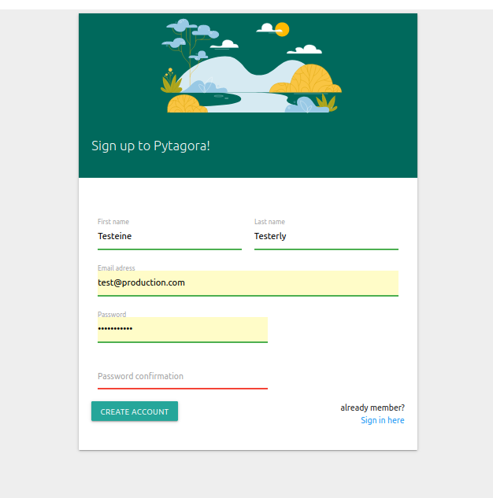
> 
> - a user can update the password through an updateform.
>
> >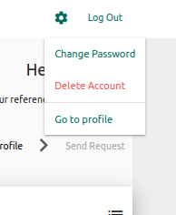
> 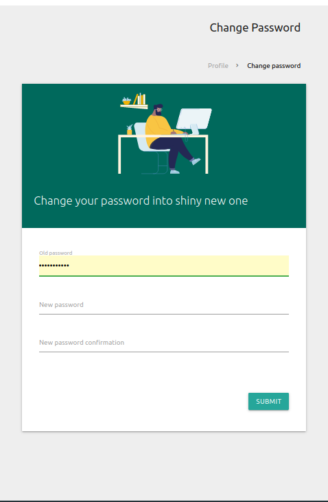
> - a user can delete herself and all related references.
> >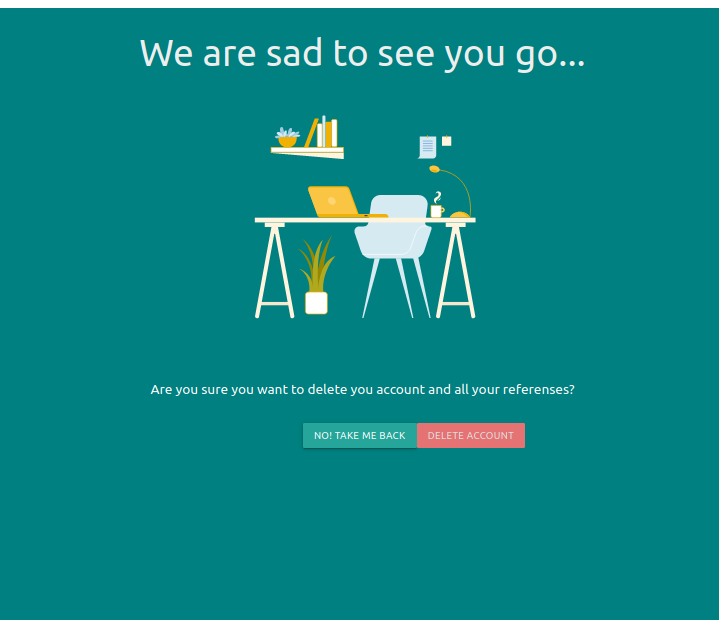
> >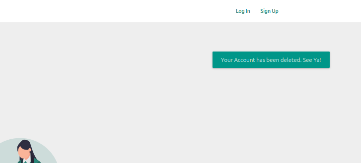
> 


## Installation

### Getting started - Prerequisites

Before running this project, make sure you you have an environment with python3.10.6 or later installed. 

there are also a few neccesary environment variables to include before running the project. On step 3 in "getting started" copy the following code into your **_env.py_** file and change the placeholder text to your personal information. 

``` python
# copy this entire block of code
# into a file named env.py
import os

# change this to YOUR secret key 
# new key can be generated here: https://djecrety.ir/
os.environ["SECRET_KEY"] = "<your secret key>"

#can be set to "None" if DEBUG and TEST_SERVER is set to true
os.environ["DATABASE_URL"] = "None"

# By having both these variables set to true
# django's SQL lite will be running as application server, 
# and emails will be logged in the console.
os.environ["DEBUG"] = "True"
os.environ["TEST_SERVER"] = "True"


#in development emails will be logged in the console. 
# so these can be set to "None" like this.
# if debug and testServer is NOT "True", 
# this must details for a real gmail account.
os.environ["EMAIL_HOST_USER"] = "None"
os.environ["EMAIL_HOST_PASSWORD"] = "None"

```


### Getting Started locally in 5 steps

These instructions will get you a copy of the project up and running on your local machine for development and testing purposes. See deployment for notes on how to deploy the project on a live system.

> **1. clone repository and cd**
> - open  terminal
> - change current work-directory to where you want the cloned directory
> - type git clone then the url to this project
> > $ ``` git clone https://github.com/4ntm4n/ms-four```
> - then change directory into the project folder:
> > $ ```cd ms-four```

> **2. Start environment and install dependencies**
> - Create a development environment with python 3.10.6. example with virtualenv and python 3.10.6 as default:
> > $ ```virtualenv pytagora_env```
> 
> > $ ```source pytagora_env/bin/activate```
>  - then, in your development environment run:
> >$ ``` pip install -r requirements.txt```

> **3.  set up environment variables**
> - create env.py file and set up mandetory environent variables shown below
> > $```nano env.py``` 
> - then paste in the code from **_Prerequisites_** above.
> - exit by pressing **'ctrl** + **x'** and **'y'** to save **_env.py_** and hit **enter** to exit nano.

> **4. Make Migrations and Migrate**
>  - run the following code to make migrations (should not be needed, but good practice before migration):
> > $ ```python3 manage.py makemigrations```
> - then migrate. 
> > $ ```python3 manage.py migrate```

> **5. run the dev server and you are done!**
> - in the terminal, type:
> > $ ```python3 manage.py runserver```
> -  go to **_http://localhost:8000/_** to run the project locally.
> > Note that the server will be hosted on **_localhost_**  and that the specific adress: **_127.0.0.1_** is not an allowed host by default in this project. 
> >
> >It can, however, be added to the **ALLOWED_HOSTS** list in **settings.py** if you want to.

### Deployment
Follow these steps to deploy this project to heroku.

> 1. create a heroku project
> 2. create a postgresql database
> 3. create a gmail account with an "_app password_"
>
> 4. in heroku config vars add the following information: 
> > ```DATABASE_URL | <link to your database>```
> 
> > ```DEBUG | False```
>  
> > ```EMAIL_HOST_PASSWORD | <your gmail 'app password'>```
>   
> > ```EMAIL_HOST_USER | <your gmail adress>```
>
> > ```SECRET_KEY | <your django secret key>```
>
> 5. push repository directly to heroku or enable deployment through github and deploy branch.


## Testing
Since I was learning how django worked, how class based views inheritence worked, and learning how to adapt the django framework to my idea as I have been buildning it out, it was almost impossible for me to know how to write automatic tests for things I did not know how they worked. 

I have therefor not skipped automatic testing in this project in order to finnish the acutal application. I have done a lot of manual testing throughout the building process however, shown below.

### Manual testing
This is the list of manual testing that was written during the time of development.
All manual tests has been carried out on a local version of of the app and not in production. 

**General tests**
Test | Successful
------|:----------:
Verify that all links on the app are working properly and redirecting to the correct pages. | [x]
Test the app's forms to ensure that they are functioning correctly and submitting the data as expected. | [x]
Test the app's authentication and authorization functionality. | [x]
Test the app's database functionality to ensure that data is being stored and retrieved correctly. | [x]
Test the app's error handling to ensure that it gracefully handles exceptions and displays appropriate error messages. | [x]
Test that the app is working even when multiple people makes request at the same time. * | [x]
Test the app's compatibility with different browsers and devices to ensure that it works correctly across a wide range of platforms. | [x]
Test the app's email functionality to ensure that emails are being sent and received correctly. | [x]
CRUD-functionality works as intended. | [x]

*not tested with the gmail account set up in the prod. version of the app. Only tested locally.


**specific tests**
Test | Successful
------|:----------:
datepickers in request form depends on eachother, and it is impossible to pick an earlier start-date than end-date. | [x]
crossfield serverside validation of date-from and date-to field is working | [x]
"other_relation" inputfield in RefResponse form (the UpdateView) is only visible if "other" is chosen in the selection dropdown | [x]
It is not possible to access a link to a RefResoónse that "competed" set to "True" | [x]
Users can not send a reference request to the same email that they signed up with | [x]
User gets a friendly notice recommending them to send request to company email and not private email (eg. gmail, hotmail, yahoo) | [x]
a user can delete a pending request and correalating pending response from profile | [x]
a user can not guess the dynamic url of the reference response, only the person who has the link can access the UpdateView | [x]
a reference responder can not re-submit an anwer by backing into a completed RefResponse and resubmit it | [x]

**testing user stories**
Test | Successful
------|:----------:
A user can initiate a reference request by herself which gives her ownership over her own references in a recruitment process | [x]
A user can store references in a personal profile, so that a reference might be re-used for multiple recruitment processes  | [x]
If a user types in the wrong information in a request it can be deleted, making it impossible to answer to that specific request | [x]
A user can delete a reference that they do not want to store | [x]
A Reference do not have to me a member to respond, making it less of a hustle to participate | [x]
A Reference can alter information that is pre populated, if they do not want to stand by information provided by requesting user (company name) | [x]
A Reference can easily find information on how to become a member and use Pytagora themselves if they find app useful | [x]
No one can update informaion to a completed reference. a response is a response. | [x]
    
    

## Some words from the developer: 
    I wish I could have spent two weeks more on this project, it has been a very tight timeschedule for me doing this course part time and learning so many new topics. I have in mostly achieved what I imagined I could create, and I see potiential in the idea of this app. Especially if you add another layer for recruiters where they can search for candidates who match thier profile based on their references and not what they write themselves in a CV. Good for people who are not good braggers.

Having that said, there are a lot of shortcomings in the testing of this app and in the UX design due to lack of time to be able to complete everything.
    
   #### aknowledgements 
   During the course of the creation of this application, I have had to learn a lot of new topics and features in Django that was not part of course material at codeinstitute. One particular useful resourse has been the webiste [ccbv.co.uk](https://ccbv.co.uk/)
    
    Appart from that, here are a few resourses I have found helpful:
    https://www.youtube.com/@DennisIvy | Dennis Ivys youtube channel
    https://studygyaan.com/django/how-to-send-email-in-django | sending email in django and creating tokens
    
    images used in my project are all from https://freesvgillustration.com/
  
    
Created by Anton Askling student @ codeinstitute.
